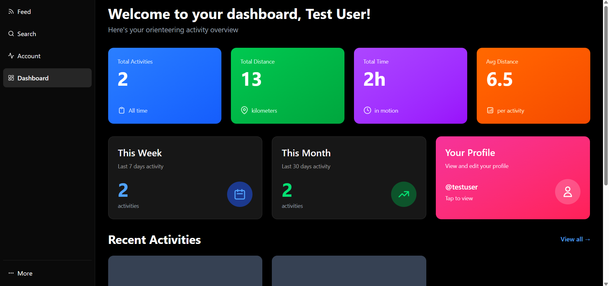
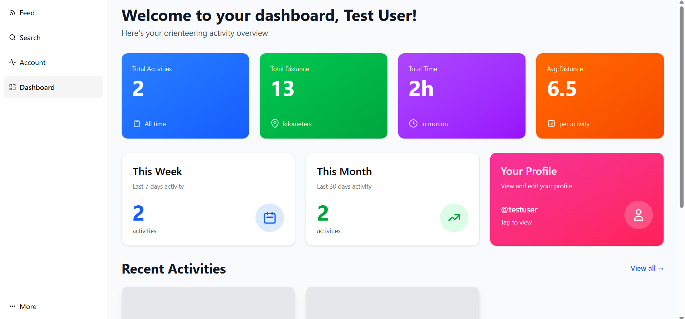
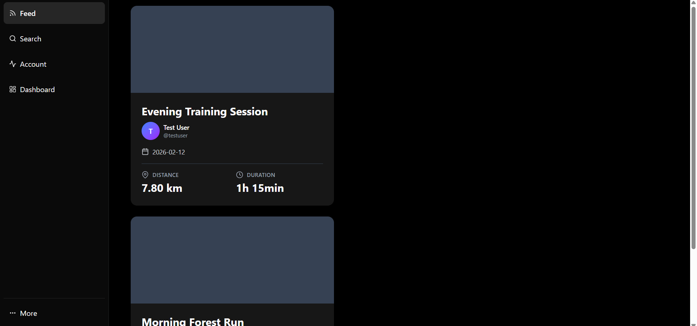
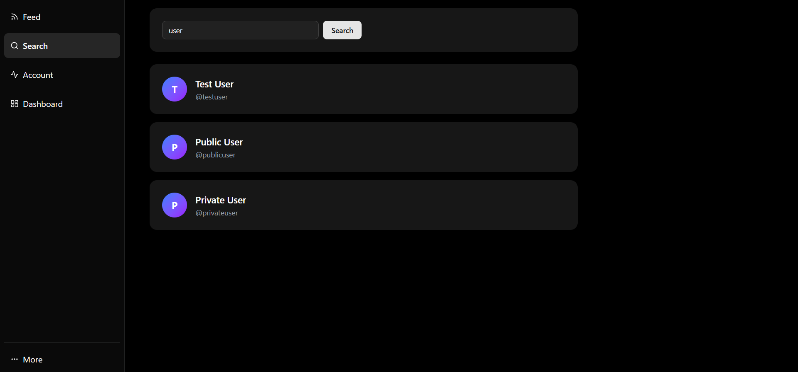
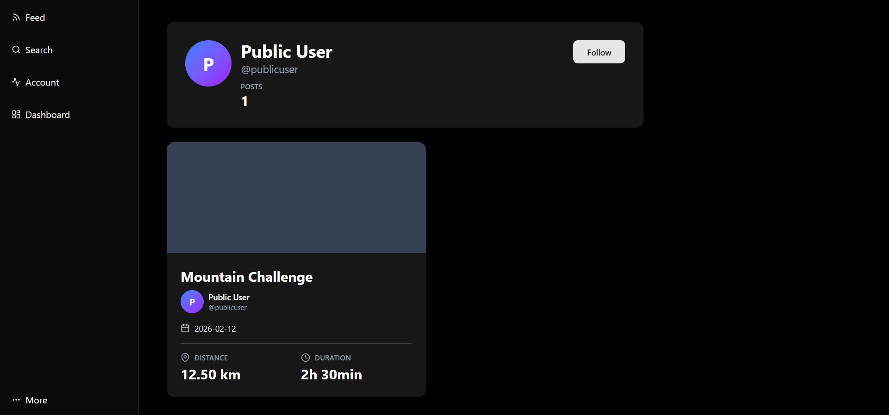

# Orienteering Web 🗺️🏃‍♂️

Orienteering Web is a web application for orienteering enthusiasts. It allows users to follow the training results of other athletes and access personal performance statistics. The application is designed as a social and analytical companion to the mobile app.

---

## 🔗 **Related Repositories**

- [Backend](https://github.com/stanislawkaczmarek1/orienteering-app)
- [Mobile Application](https://github.com/jakubwesta/mobile-orienteering)

---

## 🛠 **Technologies Used**

- TypeScript 
- React
- Shadcn/ui
- Tailwind CSS

---

## 🤝 **Team**

- [Jakub](https://github.com/jakubwesta)
- [Stanislaw](https://github.com/stanislawkaczmarek1)

---

## 📸 **Screenshots**

---
